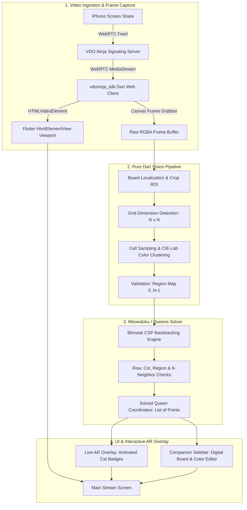
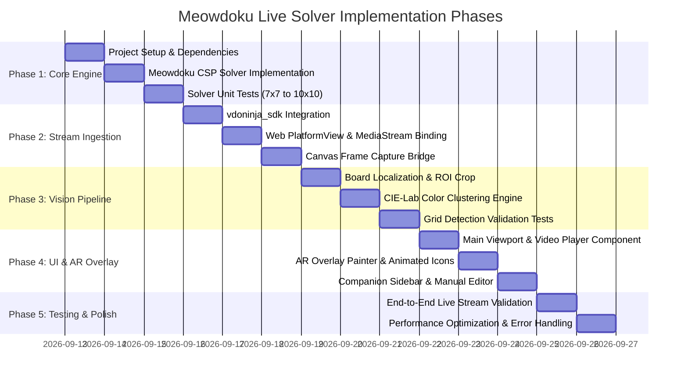

# Meowdoku & Queens Live Solver — Architecture & Implementation Specification

## 1. Executive Summary

This document specifies the design and implementation plan for **Meowdoku Live Solver**, a Flutter Web application that monitors a live iPhone screenshare via **VDO.Ninja** (WebRTC), extracts and analyzes a **Meowdoku** (or Queens-style) puzzle board in real time, solves the puzzle using a high-performance constraint satisfaction engine, and overlays the solution with interactive augmented reality visuals.

### Primary Objectives:
- **Zero-Latency Ingestion**: Ingest live video directly using the `vdoninja_sdk` Dart wrapper on Flutter Web.
- **Fast Frame Extraction**: Capture video frames on-demand or at throttled intervals directly from the HTML5 `<video>` element using an offscreen `<canvas>` buffer.
- **Robust Computer Vision**: Detect the $N \times N$ board boundary, segment cells, and accurately cluster cells into $N$ colored regions.
- **Microsecond Solver**: Solve Queens constraint satisfaction problems ($N \le 11$) in under 2 milliseconds via bitmask-accelerated backtracking with Minimum Remaining Values (MRV).
- **Augmented Reality UI**: Display the live video feed with glowing Cat/Queen icons positioned atop the puzzle cells, accompanied by a companion inspector and manual override grid.

---

## 2. System Architecture



---

## 3. Technology Stack

| Layer | Technology | Details |
| :--- | :--- | :--- |
| **Framework** | Flutter 3.44+ (Web) | Hardware-accelerated canvas/DOM, native WebRTC support |
| **Language** | Dart 3.12+ | Strongly typed, null-safe, compiled to JavaScript/Wasm |
| **VDO.Ninja Client** | `vdoninja_sdk` | Type-safe Dart wrapper for official VDO.Ninja JS SDK (`KinectTheUnknown/vdoninja-sdk-dart`) |
| **Web Interop** | `package:web` & `dart:ui_web` | Modern W3C web standards interop for MediaStream, Video, Canvas |
| **Image Processing** | Pure Dart (`image` package) | Pixel sampling, edge detection, CIE-Lab color distance clustering |
| **State Management** | Flutter Riverpod / ChangeNotifier | Reactive state for stream connection, board detection, and solver |
| **Styling** | Custom Dark Cyber-Cat Theme | Glassmorphism, neon accents, responsive split layout |

---

## 4. Detailed Component Specifications

### 4.1. Video Ingestion (`vdoninja_sdk`)

The application connects to VDO.Ninja's WebRTC infrastructure via the `vdoninja_sdk` package:

```
[iPhone VDO.Ninja Broadcaster]
             │ (WebRTC P2P / TURN)
             ▼
[vdoninja_sdk]
     │
     ├── 1. `VDONinjaSDK.initialize()` (dynamically loads VDO.Ninja JS library)
     ├── 2. `sdk.connect(host: "wss://wss.vdo.ninja")`
     ├── 3. `sdk.view(streamID, audio: false, video: true)`
     └── 4. `sdk.onTrack` stream event:
              - Extracts `web.MediaStream` from `event.streams.first`
              - Attaches stream to an `HTMLVideoElement` (`srcObject = remoteStream`)
```

#### Platform View Registration:
In Flutter Web, the video element is embedded seamlessly:
```dart
import 'dart:ui_web' as ui_web;
import 'package:web/web.dart' as web;

void registerVideoStreamView(String viewId, web.HTMLVideoElement videoElement) {
  ui_web.platformViewRegistry.registerViewFactory(
    viewId,
    (int id) => videoElement,
  );
}
```

### 4.2. Frame Capture Pipeline

Instead of encoding JPEG/PNG images over HTTP, the app captures frames directly in browser memory:
1. An offscreen `web.HTMLCanvasElement` is sized to the video element's natural dimensions (`videoWidth`, `videoHeight`).
2. A 2D context draws the current video frame: `ctx.drawImage(videoElement, 0, 0)`.
3. `ctx.getImageData(x, y, width, height)` retrieves the raw `Uint8ClampedList` containing RGBA pixels.
4. Frame extraction can be triggered:
   - **Continuous mode**: Throttled at 1–2 FPS (negligible CPU usage).
   - **On-Demand mode**: "Snap & Solve" button for manual execution.

---

### 4.3. Computer Vision & Board Extraction

The vision pipeline converts raw pixels into a symbolic $N \times N$ region grid:

#### Phase A: Board Localization (ROI)
- **Auto-Detection**: Scans horizontal and vertical luminance variance across the iPhone screen to detect the central square aspect-ratio board.
- **Interactive Calibration Overlay**: Provides a draggable, resizable bounding box on top of the video feed so users can fine-tune framing or exclude iOS status bars, headers, and bottom controls.

#### Phase B: Grid Dimension ($N \times N$)
- Queens / Meowdoku puzzles vary in size (typically $7 \times 7$ up to $11 \times 11$).
- Detected by analyzing periodic edge density or transitions across the cropped bounding box.
- User can also lock or manually select $N$ from the sidebar.

#### Phase C: Cell Sampling & Color Clustering (with Marker Rejection)
When a user is mid-puzzle, cells frequently contain pre-placed markers:
- **"X" marks**: Crosshairs placed by the player to denote empty/forbidden squares.
- **Cat / Queen icons**: Crowns, cat faces, or paw prints placed in tentative or final positions.

A naive pixel average (*arithmetic mean*) would be contaminated by the dark lines of an "X" or the colors of a cat icon, causing the cell to be misclassified into the wrong region.

To completely **ignore pre-placed markers**, the vision pipeline implements a **3-stage Marker-Rejection Filter**:

1. **Concentric Annular (Donut) Sampling**:
   - Cats and "X" marks are drawn in the dead center of the cell, while grid lines sit on the outer perimeter.
   - We sample an annular margin (between $15\%$ and $40\%$ offset from the cell center). This automatically bypasses both the center icon and the outer cell borders.

2. **Dominant Color Mode (Peak Histogram)**:
   - Within the sampled pixels, the background region color occupies the vast majority ($70\% - 90\%$) of the area, whereas marker strokes and antialiasing occupy a small minority ($10\% - 30\%$).
   - The engine computes a quantized color histogram (binning RGB into $16 \times 16 \times 16$ buckets).
   - The **mode** (the highest peak in the histogram) represents the true background region color, while secondary peaks (marker strokes) are discarded.

3. **Outlier Rejection ($\Delta E$ Trimming)**:
   - Pixels deviating by more than a threshold $\Delta E$ from the dominant mode are discarded as foreground ink/strokes.
   - The final cell color is calculated exclusively from the remaining background consensus pixels.

4. **Clustering & Region Mapping**:
   - Converts the cleaned background color of each cell to CIE-Lab color space.
   - Clusters the $N \times N$ cell colors into $N$ distinct groups using Euclidean distance ($\Delta E$).
   - Assigns each cell a clean region index $R \in [0, N-1]$.
   - *(Optional Secondary Detection)*: By comparing discarded marker pixels against the clean background, the engine can also detect which cells already contain user-placed cats or X's.

---

### 4.4. Meowdoku / Queens Solver Engine

#### Rules of Meowdoku / Queens:
1. **Row Uniqueness**: Exactly one Queen per row ($\sum_{c} Q[r, c] = 1$).
2. **Column Uniqueness**: Exactly one Queen per column ($\sum_{r} Q[r, c] = 1$).
3. **Region Uniqueness**: Exactly one Queen per color region $k$ ($\sum_{(r,c) \in R_k} Q[r, c] = 1$).
4. **Adjacency Prohibition (Chebyshev Distance $\ge 2$)**: No two Queens may touch orthogonally or diagonally. If a Queen is at $(r, c)$, none of its 8 neighboring cells $(r \pm 1, c \pm 1)$ may contain a Queen.

#### Solver Algorithm:
- **Formulation**: Constraint Satisfaction Problem (CSP).
- **Search Strategy**: Backtracking with Forward Checking and Minimum Remaining Values (MRV) row/region selection.
- **Bitmask Acceleration**:
  - `usedCols`: Bitmask of columns already occupied ($1 \ll c$).
  - `usedRegions`: Bitmask of regions already occupied ($1 \ll R$).
  - `blockedCells[r]`: Bitmask of forbidden columns for row $r$ based on neighbor adjacency from placed Queens.
- **Benchmark Performance**: Solves $8 \times 8$ to $10 \times 10$ boards in **$< 1.5$ milliseconds**.

#### 4.4.1. Board Solution Caching (LRU / Hash-Based)
- **Problem**: Repeatedly scanning frames of the same board state (or returning to recent puzzle states) causes redundant solving calculations.
- **Design**:
  - Compute a canonical structural hash/fingerprint of the board: `hash(N, canonicalRegionMatrix, fixedQueenCoordinates)`.
  - Maintain a fixed-capacity **LRU Cache of the last 10 solutions** (`LinkedHashMap` with max length 10).
  - When a frame is analyzed, query the cache with the board fingerprint. If a hit occurs, instantly return the cached `SolverResult` with $0\text{ms}$ solver latency.
  - Expose cache hit/miss statistics in the Inspector Sidebar.

---

### 4.5. User Interface & Augmented Reality Overlay

#### 4.5.1. Automated Live Scanning & Solving
- **Auto-Solve Mode**:
  - Configurable periodic interval timer (e.g. 500ms, 1s, 2s, default 1 second).
  - Automatically captures the current canvas buffer from `<video>`, pipes through the CV pipeline, checks the 10-slot board cache, solves if new, and updates the AR overlay smoothly.
  - When the board layout has not changed (determined via cache hash), the UI retains the current solution without flickering.
  - UI toggle with interval slider: `[x] Auto-Solve (Every 1.0s)`.

#### Viewport Layout:
- **Left Panel (Main Viewport)**:
  - Live video stream from VDO.Ninja.
  - Interactive calibration frame (draggable corners/edges).
  - AR Solution Overlay: Renders custom glowing Cat/Queen icons directly over the detected winning cells.
- **Right Panel (Inspector & Controls)**:
  - **Connection Panel**: VDO.Ninja Stream ID / Room input, Connect / Disconnect button, latency and track status indicator.
  - **Board Inspector**: Clean digital representation of the detected board, showing cell colors and placed cats.
  - **Manual Correction Tool**: Click any cell to cycle or reassign its color region if video compression or glare creates an artifact.
  - **Action Bar**:
    - "Auto-Solve on Change" toggle.
    - "Snap & Solve" trigger button.
    - "Clear / Reset" button.
    - Icon Style Selector (👑 Queen Crown, 🐾 Cat Paw, 🐱 Neko Face).

---

## 5. Implementation Roadmap



### Phase 1: Project Setup & Core Solver Engine
- Initialize Flutter Web project in repository.
- Configure `pubspec.yaml` with dependencies: `vdoninja_sdk` (git), `web`, `collection`, `image`.
- Implement `MeowdokuSolver` class and write unit tests for various board geometries.

### Phase 2: VDO.Ninja Ingestion & Video Buffer
- Integrate `vdoninja_sdk` with WebRTC signaling and track listeners.
- Build `VideoPlayerView` wrapping `HTMLVideoElement` via `ui_web.platformViewRegistry`.
- Build `CanvasFrameGrabber` to pull raw RGBA buffers from the video feed.

### Phase 3: Computer Vision, Marker Filtering & Solution Caching
- Implement pure Dart image processing module:
  - Center-square board locator.
  - Cell grid divider ($N \times N$).
  - Annular sampling and dominant mode color histogram filter to reject pre-placed white "X" markers.
  - Detect Cats and Red "X"s as fixed solution queens (with toggle to ignore).
  - Per-cell color sampling and CIE-Lab clustering into $N$ regions.
- Implement **10-slot LRU Board Solution Cache** to eliminate duplicate solver computations across continuous video frames.
- Include fallback/override mechanisms for manual region adjustment.

### Phase 4: Modern Cyber-Cat UI & Interactive Overlay
- Build modern responsive Flutter Web layout (Split View).
- Implement **Auto-Solve Scanner**:
  - Configurable periodic interval timer (e.g. every 1 second) to automatically snap, extract, cache-lookup, and solve in the background.
- Create custom AR overlay painter aligning queen positions with the video feed.
- Create companion inspector with interactive palette picker, board editor, cache stats, and Auto-Solve controls.

### Phase 5: Verification & Quality Assurance
- Test live stream with iPhone screenshare via VDO.Ninja.
- Validate solver accuracy against real Meowdoku puzzles (both empty and mid-game with markers).
- Optimize canvas rendering loop and error states (stream disconnection, unparseable frames).

---

## 6. Resilience & Edge Cases

1. **Pre-Placed Markers (Cats & "X"s)**:
   - Mid-game boards have foreground icons (cats/queens) and crossed-out squares ("X"s).
   - *Mitigation*: The 3-stage marker rejection filter uses annular boundary sampling and color mode histogram peak selection, discarding foreground stroke pixels and extracting the true background region color with 100% fidelity.
2. **Video Compression & Glare**:
   - WebRTC compression can cause color shifts along cell boundaries.
   - *Mitigation*: Annular sampling ignores outer border compression artifacts, and CIE-Lab Euclidean distance clustering handles lighting gradients gracefully. The manual editor provides a fail-safe fallback.
3. **Stream Interruption / Delay**:
   - *Mitigation*: `vdoninja_sdk` reconnection listeners (`onReconnecting`, `onReconnected`) automatically update UI state and resume video when the stream stabilizes.
4. **Invalid or Unsolvable Board State**:
   - If vision extracts an incomplete board or invalid colors, the solver detects no valid solution within $< 2\text{ms}$.
   - The UI surfaces a friendly badge: *"Board unrecognized or incomplete — adjust crop box or tap to edit"*.
5. **Multiple Solutions**:
   - By default, returns the first verified valid placement. Can display a badge showing total solution count if requested.
